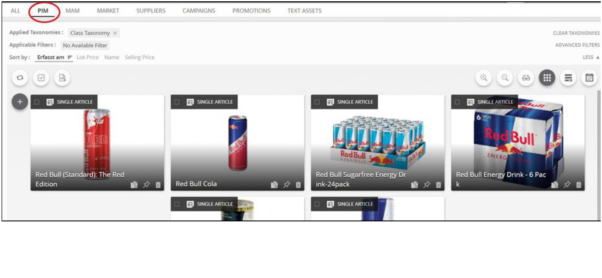
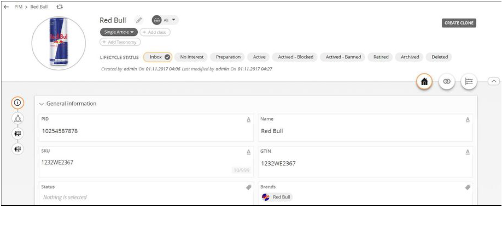

.. PROD-3: Manage Individual Articles documentation master file, created by
   sphinx-quickstart on Wed Nov 15 09:23:40 2017.
   You can adapt this file completely to your liking, but it should at least
   contain the root `toctree` directive.

PROD-3: Manage Individual Articles
===================================
The Individual Articles are called as 'Single Article' in the system. This 'Single Article' will only be a single item.

.. toctree::
   :maxdepth: 2

1. Go to PIM
---------------

2. Click on the '+' icon and select SINGLE ARTICLE
-----------------------------------------------------
.. image:: _static/step2.png

3. Give it a name and fill some information
----------------------------------------------
.. image:: _static/step3.png

4. Go to the relationship tab to add an image
------------------------------------------------

5. Click on the plus icon to add an image
--------------------------------------------
.. image:: _static/step5.png

6. Select the image and click on add button or drag and drop the image to the right
---------------------------------------------------------------------------------------
.. image:: _static/step6.png

7. Image is added to the product
-----------------------------------

8. Similarly markets, related products can be added via relationship
-----------------------------------------------------------------------
.. image:: _static/step8.png

9. Your Single Article
-------------------------

.. Indices and tables
.. ==================

.. * :ref:`genindex`
.. * :ref:`modindex`
.. * :ref:`search`
